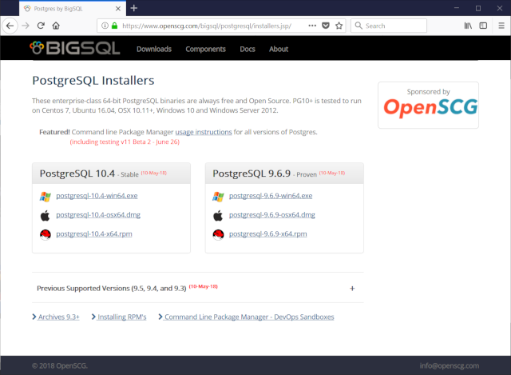
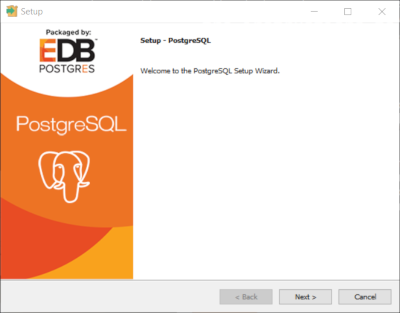
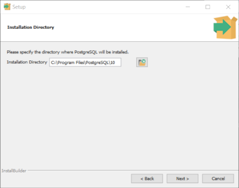
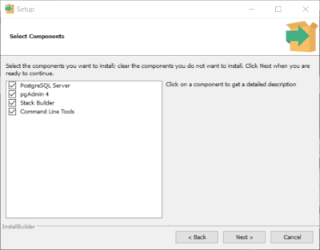
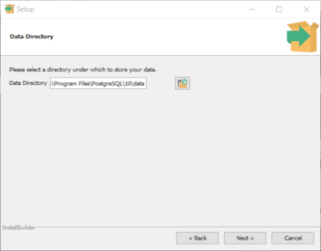
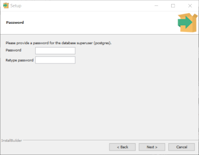
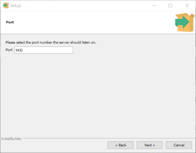
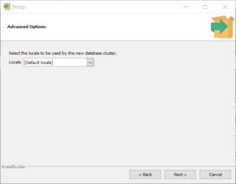
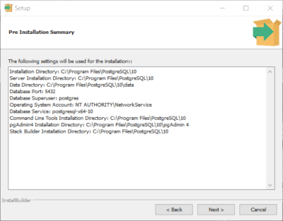

# Installation

	There are two parts to installing tabitha: (1) PostgreSQL and
	(2) tabitha. Downloading the files and installing them could
	take up to an hour. 

## Overview

	There is a process to installing and getting a working version
	of the software. You must install PostgreSQL. PostgreSQL is an
	object-relational database that is used to store data.
	There are manual steps required. Therefore, it is recommened you
	read all of the steps first to get acquanited with the commands.
	Failure to exucute them correctly can leave the database in an
	unkown state. If this happens, additional steps will have to be
	executed to restore the system back to a sane state.

## Summary

	* Download and install PostgreSQL
	* Download and install tabitha
	* Initialize PostgreSQL database
	* Load tabitha schema

## PostgreSQL

	You may skip this section if PostgreSQL is already installed.
	However, you may want to think about upgrading if your version
	is nearing it's end of life.

	PostgreSQL download page has several releases of it's software
	avialbe for download. It is recommened to retrieve the latest
	stable version. 

	You will be using PostgreSQL website to locate and download the
	release of the specific version you require.

	Primary site: https://www.postgresql.org/

	Download page: https://www.postgresql.org/download/windows/

	It is recommened to install the bundle supplied from BigSQL.

	

	Download page:

	https://www.openscg.com/bigsql/postgresql/installers.jsp/

	The lastet version as of this writing is PostgreSQL 10.4. Using
	your mouse click on the 10.4 version by the Windows icon. Follow
	the instructions to 'Save' the file to disk. Browsers will
	typically save the file into your users Downloads directory. 

	After downloading, using a login with adminstrative rights,
	browse to the directory and execute it.

	

	Accepting the default install options throughout the screens should
	be sufficent. 

	

	

	

	

	

	

	

	

	

## tabitha

	tabitha for Windows comes with a prepackeged self installer.
	After downloading the package, start the installer and it will
	guide you through the process.

	tabitha does not make use of the system registry. All files are
	installed in a root directory. That folder can be deleted to
	remove the software. However, it is recommened to use WIndows
	Control Panel to remove the application.

## Post Install

